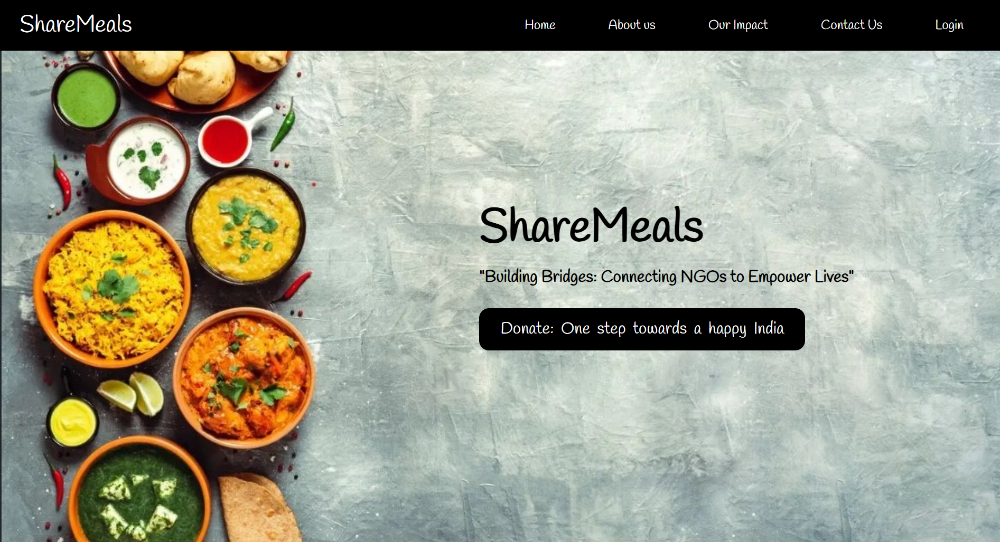

# ShareMeals 🍲

ShareMeals is a revolutionary platform that simplifies the process of food donation, connecting food donors with NGOs in need. Our platform streamlines the donation process, making it easier than ever to share meals with those in need. Whether you're a restaurant looking to donate excess food or an NGO searching for donations, ShareMeals is the bridge that connects you.

### 🚀 Key Features:
- **Effortless Donation:** Easily donate food with just a few clicks, reducing food waste and helping those in need.
- **Full stack website:** It consists of both the frontend, which users interact with, and the backend, which handles the logic and data storage.
- **Accounts:**: Users can create distinct accounts as either an NGO or a food donor, each offering a tailored user interface to meet their specific needs and interactions with the platform.
- **Dynamic and User-Friendly:** Built with Flask, our platform is dynamic and user-friendly, providing a seamless experience for both donors and NGOs.
- **Database Integration:** The working database ensures that all donations and requests are accurately tracked and managed.

### 🧠 How It Works:
1. **Food Donation:** Donors create an account and list their available food donations.
2. **NGO Requests:** NGOs browse available donations and request what they need.
3. **Donation Confirmation:** Donors confirm the donation, and NGOs collect the food.

### 🤖 Technologies Used:
- Flask
- HTML
- CSS
- Python
- SQL (Database)

### 🖼️ Screenshots:

### 💻 Installation:
1. Clone this repository to your local machine.
2. Install the required dependencies using `pip install -r requirements.txt`.
3. Run the Flask application using `python project.py`.
4. Access the application at `http://localhost:5000`.
5. Go to: `/home` to view the landing page for donors
6. (Database will be available soon)

### 📝 Author
Achintya Varshneya
